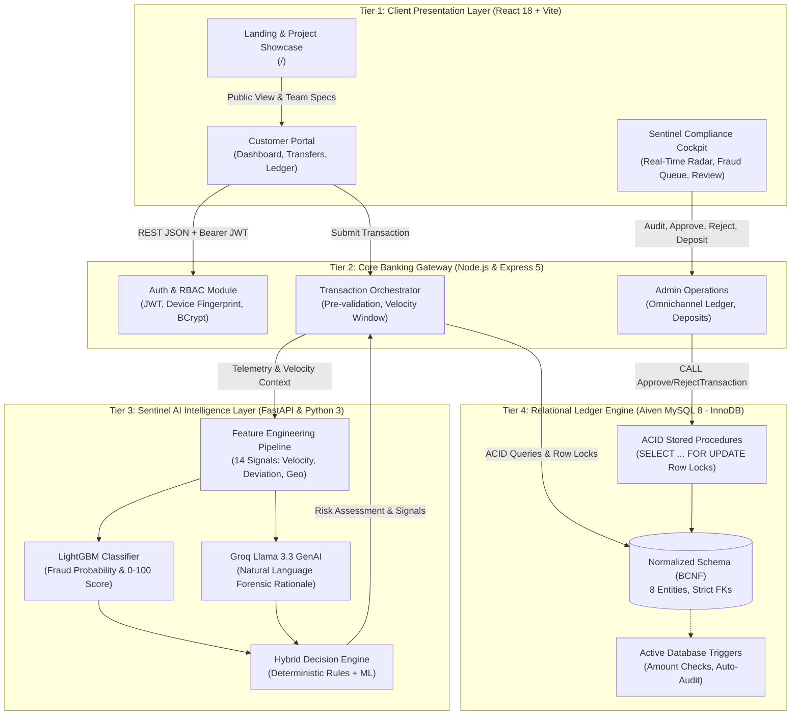
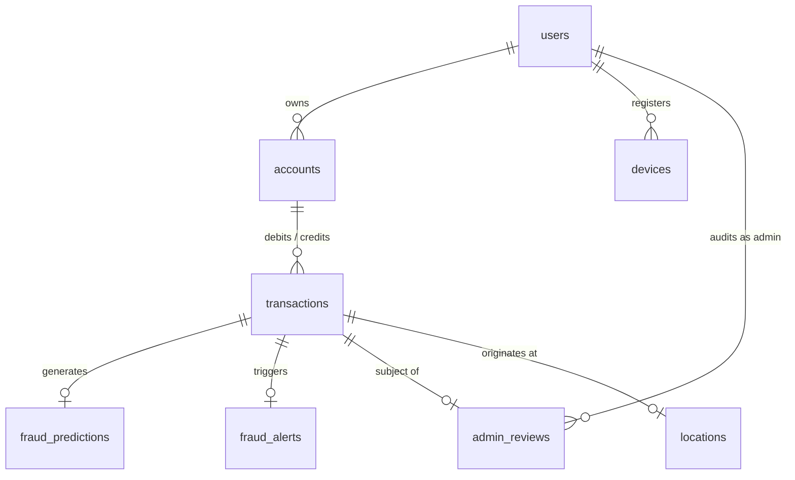

<div align="center">

# 🛡️ TrustPay
### AI-Powered Fraud Detection & Real-Time Banking Platform

An enterprise-grade, multi-tiered financial intelligence system that processes high-throughput banking transactions while executing real-time threat analysis in **&lt; 180ms**. Combines a trained **LightGBM** machine learning classifier, **Groq Llama 3.3** explainable AI, and **MySQL 8** ACID stored procedures with row-level locks (`SELECT ... FOR UPDATE`).

---

**🎓 Academic Capstone Project**  
*Department of Computer Science & Engineering • Final Year Engineering Evaluation 2026*

---

[](#)
[](https://trustpay-backend-service.onrender.com/api/health)
[](#)
[](#)
[](#)
[](#)
[](#)
[](#)
[](#license)

[🌐 Live API Health](https://trustpay-backend-service.onrender.com/api/health) · [📖 Project Report](TRUSTPAY_FULL_PROJECT_REPORT.md) · [📑 PDF Report](TRUSTPAY_PROJECT_REPORT.pdf)

</div>

---

## 👥 Project Team Members

This project was engineered and submitted as a Final Year Major Project by students of the **Department of Computer Science & Engineering**:

| Member # | Student Name | Registration Number | Department |
| :---: | :--- | :---: | :--- |
| **Member 1** | **Raghav Gupta** | `20243226` | B.Tech • Computer Science & Engineering |
| **Member 2** | **Rishabh Srivastava** | `20243236` | B.Tech • Computer Science & Engineering |
| **Member 3** | **Rihabh Singh** | `20243235` | B.Tech • Computer Science & Engineering |
| **Member 4** | **Prince Keshari** | `20243218` | B.Tech • Computer Science & Engineering |

---

## 📖 Table of Contents

- [Overview](#-overview)
- [Live Deployments & Endpoints](#-live-deployments--endpoints)
- [4-Tier Distributed Architecture](#-4-tier-distributed-architecture)
- [Key Features](#-key-features)
- [Machine Learning & Sentinel AI Engine](#-machine-learning--sentinel-ai-engine)
- [Generative AI Explainability (Groq Llama 3.3)](#-generative-ai-explainability-groq-llama-33)
- [Database Normalization & ACID Concurrency](#-database-normalization--acid-concurrency)
- [Real-Time Transaction Workflow](#-real-time-transaction-workflow)
- [Project Directory Structure](#-project-directory-structure)
- [Getting Started & Local Setup](#-getting-started--local-setup)
- [API Reference](#-api-reference)
- [Security & Compliance](#-security--compliance)
- [License](#-license)

---

## 🔍 Overview

Traditional core banking software executes transactions in isolation without analyzing real-time behavioral deviation or spatial telemetry. Consequently, account takeovers, velocity spikes, and geographically improbable transactions often go undetected until post-settlement reconciliation.

**TrustPay** bridges this critical gap. Every financial transaction is enriched with client device fingerprinting, browser geolocation, and a 15-minute velocity window. In **&lt; 180ms**, the transaction is evaluated by a trained **LightGBM** classifier, explained in plain language by **Groq Llama 3.3**, and triaged:
- **Low / Medium Risk**: Settled atomically via MySQL stored procedures with row-level locks.
- **High Risk**: Locked in `PENDING` state and routed to the **Sentinel Admin Cockpit** for operator telephone verification.

---

## 🌐 Live Deployments & Endpoints

| Service Tier | Hosting Platform | URL / Endpoint | Status |
| :--- | :--- | :--- | :--- |
| **Core Banking API Gateway** | Render Cloud | `https://trustpay-backend-service.onrender.com/api` | Live Active |
| **System Health Check** | Render Cloud | `https://trustpay-backend-service.onrender.com/api/health` | `{"status":"OK"}` |
| **Sentinel AI Service** | Python FastAPI Host | `http://localhost:8000` (FastAPI Docs: `/docs`) | Active |
| **Cloud Relational Ledger** | Aiven Cloud | MySQL 8.0.35 Enterprise (InnoDB Engine) | Active (SSL) |
| **Frontend Client SPA** | Vite / Netlify / Vercel | Single Page Application with Responsive UI/UX | Ready |

---

## 🏗️ 4-Tier Distributed Architecture



---

## ✨ Key Features

1. **Hybrid Threat Detection**: Combines cold-start deterministic rules with continuous LightGBM probabilistic classification.
2. **Sub-200ms Inference**: Streamlined feature extraction pipeline written in FastAPI / Python.
3. **Explainable AI (XAI)**: Groq-accelerated Llama 3.3 model produces instant forensic rationales for flagged transactions.
4. **ACID Concurrency**: MySQL InnoDB row-level locking (`SELECT ... FOR UPDATE`) guarantees zero double-spending or race conditions.
5. **BCNF Relational Normalization**: 8 normalized tables eliminating update, insertion, and deletion anomalies.
6. **Device & Geolocation Telemetry**: Captures client browser UUIDs and HTML5 geolocation coordinates for velocity anomaly tracking.
7. **Sentinel Admin Review Cockpit**: Compliance interface with quick telephone verification shortcuts (`tel:` links) and one-click audit actions.
8. **Automated Audit Trail**: Dedicated `admin_reviews` table and `fraud_monitoring` view permanently record every operator decision.
9. **Responsive High-Contrast UI/UX**: Custom design tokens, dark/light theme toggle, mobile-friendly transaction cards, and WCAG AA/AAA compliance.
10. **Public Landing & Team Showcase**: Dedicated `/` page highlighting the 4-tier architecture and academic project contributors.

---

## 🧠 Machine Learning & Sentinel AI Engine

The Sentinel AI service computes 14 engineered features from the transaction payload and historical customer activity:

| Feature Category | Mathematical / Logical Definition | Purpose |
| :--- | :--- | :--- |
| **Transaction Attributes** | `amount`, `hour_of_day`, `is_night`, `is_weekend` | Baseline spending patterns |
| **Statistical Baseline** | `avg_amount`, `min_amount`, `max_amount`, `std_amount` | Individual spending profile |
| **Deviation Z-Score** | $Z = \frac{\text{amount} - \mu}{\sigma}$ | Detects sudden value outliers |
| **Recency & Velocity** | `tx_count_1h`, `amount_1h`, `tx_count_24h`, `amount_24h` | Detects rapid automated fund draining |
| **Spatial Anomaly** | Haversine formula on $(\text{lat}_1, \text{lon}_1)$ vs $(\text{lat}_2, \text{lon}_2)$ | Detects impossible travel velocity |
| **Client Fingerprint** | Browser device UUID match vs registered profile | Detects session hijacking & credential theft |

**Sample Classification Output:**
```json
{
  "fraud_probability": 0.884,
  "risk_score": 88,
  "risk_level": "HIGH",
  "action": "PENDING_REVIEW",
  "reasons": [
    "Transaction amount deviates 4.2x from account average",
    "Velocity spike detected in current 15-minute window"
  ]
}
```

---

## 🤖 Generative AI Explainability (Groq Llama 3.3)

Rather than outputting cryptic probability floats, TrustPay synthesizes natural language risk explanations via the **Groq Llama 3.3 70B Versatile** engine:

> *"The transaction amount of ₹75,400.00 significantly exceeds the customer's average of ₹18,000.00. Furthermore, 3 high-value transfers occurred in the past 15 minutes, indicating potential account takeover. Geolocation coordinates align with recent logins. Action: Admin verification strongly recommended."*

---

## 🗄️ Database Normalization & ACID Concurrency

The database is deployed on **Aiven Cloud MySQL 8 Enterprise** using the InnoDB storage engine.



### Stored Procedures for Concurrency Defense
State mutations run through ACID stored procedures that lock the account and transaction rows:
- **`ApproveTransaction(p_transaction_id, p_admin_id, p_reason)`**:
  Executes `SELECT balance FROM accounts WHERE account_id = ... FOR UPDATE`, deducts balance, changes status to `APPROVED`, resolves the alert, and logs to `admin_reviews`.
- **`RejectTransaction(p_transaction_id, p_admin_id, p_reason)`**:
  Atomically reverts status to `REJECTED`, resolves alert, and records justification.

### Active Triggers
- `before_transaction_insert`: Rejects zero or negative amounts at the engine level.
- `before_account_insert`: Validates initial account balance integrity.

---

## 📂 Project Directory Structure

```
trustpay/
├── frontend/                        # React 18 + Vite SPA Client
│   ├── public/                      # Static assets & SPA redirect configs (_redirects)
│   ├── src/
│   │   ├── components/              # Shared UI (TransactionTable, Modal, Sidebar, Navbar)
│   │   ├── context/                 # AuthContext, ThemeContext, ToastContext
│   │   ├── pages/
│   │   │   ├── LandingPage.jsx      # Public landing page & project team showcase
│   │   │   ├── auth/                # Login, Register
│   │   │   ├── customer/            # CustomerDashboard, MakeTransaction, Transactions
│   │   │   └── admin/               # AdminDashboard, FraudAlerts, AdminTransactions, Analytics
│   │   └── services/                # Axios API client (api.js), authService, adminService
│   └── package.json
├── backend/                         # Node.js + Express 5 API Gateway
│   ├── src/
│   │   ├── config/                  # Database pool, environment configurations
│   │   ├── controllers/             # Auth, Account, Transaction, Admin controllers
│   │   ├── middleware/              # JWT verification, RBAC guards, device capture
│   │   └── routes/                  # Express route definitions
│   └── package.json
├── ml-service/                      # Python 3 + FastAPI Sentinel AI Service
│   ├── app/
│   │   ├── features/                # 14-feature engineering pipeline
│   │   ├── model/                   # LightGBM model artifact & inference logic
│   │   ├── genai/                   # Groq Llama 3.3 prompt formatting
│   │   └── main.py                  # FastAPI application endpoints
│   └── requirements.txt
├── database/                        # Database Architecture Scripts
│   ├── schema.sql                   # 8 BCNF normalized tables
│   ├── stored_procedures.sql        # ApproveTransaction & RejectTransaction procedures
│   └── triggers.sql                 # Integrity triggers
├── TRUSTPAY_PROJECT_REPORT.pdf      # 9-page publication-grade PDF report
├── TRUSTPAY_FULL_PROJECT_REPORT.md  # Comprehensive technical architecture report
├── docker-compose.yml               # Containerization manifest
└── README.md                        # Project documentation
```

---

## 🚀 Getting Started & Local Setup

### Prerequisites
- **Node.js**: $\ge 18.0$
- **Python**: $\ge 3.10$
- **MySQL**: $\ge 8.0$ (or an Aiven Cloud MySQL instance)
- **Groq API Key**: Obtainable from [console.groq.com](https://console.groq.com)

### 1. Clone Repository
```bash
git clone https://github.com/<your-username>/trustpay.git
cd trustpay
```

### 2. Configure Environment Variables

**`backend/.env`**:
```env
PORT=5000
DB_HOST=your-mysql-host.aivencloud.com
DB_PORT=your-port
DB_USER=your-user
DB_PASSWORD=your-password
DB_NAME=trustpay
JWT_SECRET=your-secure-jwt-secret
ML_SERVICE_URL=http://localhost:8000
```

**`ml-service/.env`**:
```env
GROQ_API_KEY=gsk_your_groq_api_key
MODEL_PATH=app/model/lightgbm_fraud_model.txt
PORT=8000
```

**`frontend/.env`**:
```env
VITE_API_URL=https://trustpay-backend-service.onrender.com/api
```

### 3. Install Dependencies & Run

```bash
# Terminal 1: Sentinel AI Service
cd ml-service
pip install -r requirements.txt
uvicorn app.main:app --reload --port 8000

# Terminal 2: Core Banking Gateway
cd backend
npm install
npm run dev

# Terminal 3: Client Presentation Layer
cd frontend
npm install
npm run dev
```

Visit `http://localhost:5173/` in your browser.

---

## 📡 API Reference

Base URL: `https://trustpay-backend-service.onrender.com/api` (or local `http://localhost:5000/api`)

| Method | Endpoint | Description | Access |
| :--- | :--- | :--- | :--- |
| `GET` | `/health` | System health check and database connectivity | Public |
| `POST` | `/auth/register` | Register customer with phone, email, and password | Public |
| `POST` | `/auth/login` | Authenticate customer/admin, returns Bearer JWT | Public |
| `GET` | `/accounts/me` | Fetch active customer balance and account details | Customer |
| `POST` | `/transactions` | Submit transfer with amount, payee, and geolocation | Customer |
| `GET` | `/transactions/history` | Retrieve personal transaction ledger | Customer |
| `GET` | `/admin/fraud-alerts` | Fetch priority queue of HIGH/CRITICAL risk alerts | Admin |
| `POST` | `/admin/transactions/:id/approve` | Execute `ApproveTransaction` stored procedure | Admin |
| `POST` | `/admin/transactions/:id/reject` | Execute `RejectTransaction` stored procedure | Admin |
| `GET` | `/admin/transactions` | Omnichannel ledger across all customers | Admin |
| `POST` | `/admin/accounts/credit` | Administrative liquidity credit/deposit | Admin |

---

## 🔒 Security & Compliance

- **Authentication**: Stateless HMAC SHA-256 JWT tokens with automatic expiry handling.
- **Credential Storage**: Passwords hashed using `bcrypt` with work factor 10.
- **Transport Security**: Enforced HTTPS/TLS 256-bit encryption on all endpoints.
- **Race Condition Immunity**: Database updates guarded by InnoDB row-level locks.
- **Audit Immutability**: All administrative actions logged permanently with timestamps and operator notes.

---

## 📄 License

Distributed under the **MIT License**. See `LICENSE` for more information.

---

<div align="center">
<strong>TrustPay Engineering Project • 2026</strong><br/>
Department of Computer Science & Engineering
</div>
