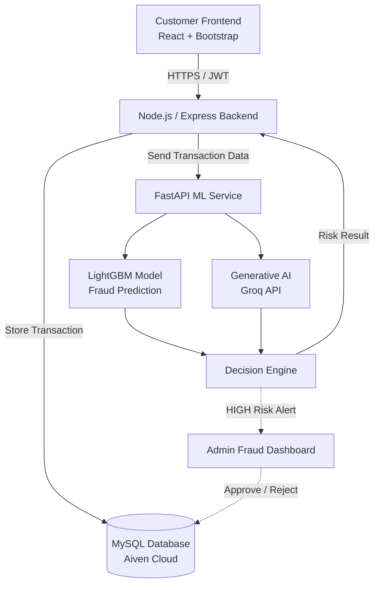
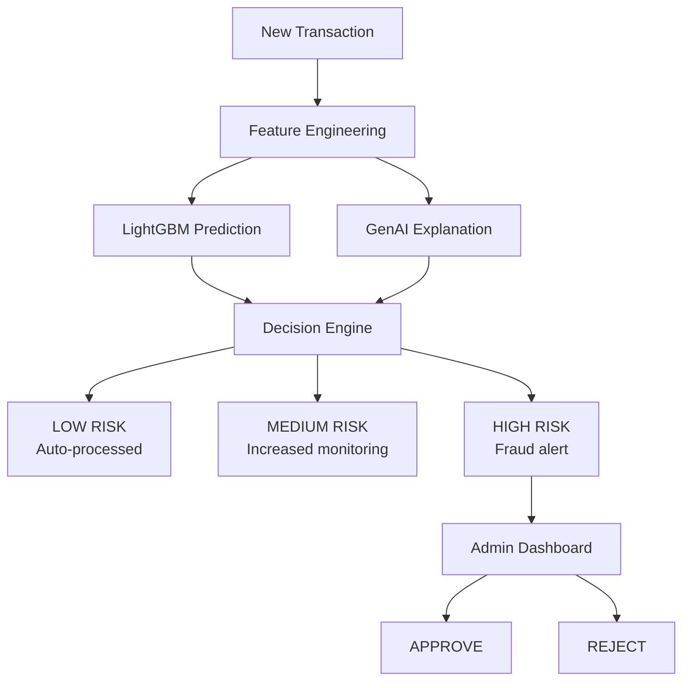
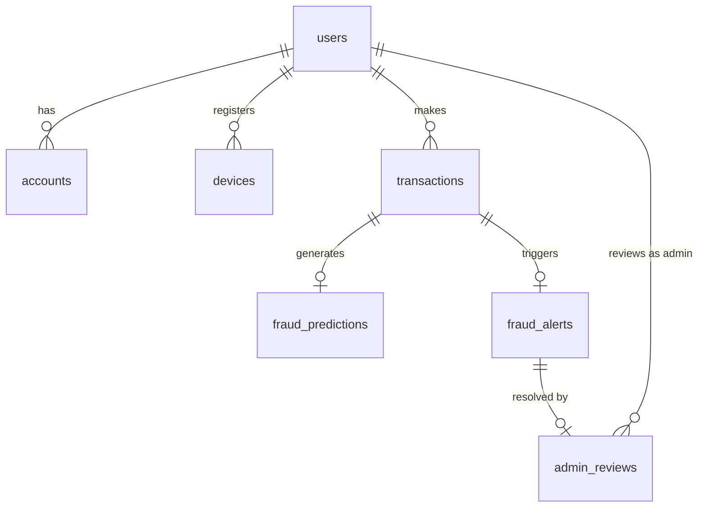

<div align="center">

# 🛡️ TrustPay

### AI-Powered Fraud Detection & Transaction Monitoring System

A full-stack banking platform that uses customer transaction history, **LightGBM** machine learning, and **Generative AI** to score fraud risk in real time, automatically flag suspicious transactions, and give administrators an auditable approve/reject workflow.

[](#license)


[Live Demo](#) · [Report Bug](../../issues) · [Request Feature](../../issues)

</div>

---

## 📖 Table of Contents

- [Overview](#-overview)
- [Screenshots](#-screenshots)
- [Key Features](#-key-features)
- [Architecture](#-architecture)
- [Tech Stack](#-tech-stack)
- [Machine Learning Component](#-machine-learning-component)
- [Generative AI Component](#-generative-ai-component)
- [Risk Decision System](#-risk-decision-system)
- [Database Schema](#-database-schema)
- [Project Structure](#-project-structure)
- [Getting Started](#-getting-started)
  - [Prerequisites](#prerequisites)
  - [Installation](#installation)
  - [Environment Variables](#environment-variables)
  - [Running the App](#running-the-app)
- [API Reference](#-api-reference)
- [Security](#-security)
- [Testing](#-testing)
- [Deployment](#-deployment)
- [Roadmap](#-roadmap)
- [Contributing](#-contributing)
- [License](#-license)
- [Acknowledgements](#-acknowledgements)

---

## 🔍 Overview

Traditional transaction systems process payments without deeply analyzing a customer's historical behavior. A transaction can look normal in isolation but become suspicious when compared against the customer's usual amounts, frequency, timing, devices, and locations.

**TrustPay** closes that gap. Every transaction is enriched with behavioral features, scored by a **LightGBM** fraud model, explained in plain language by a **Groq**-powered LLM, and — if it's high risk — routed to a human administrator who verifies it with the customer before approving or rejecting it. Every decision is logged for audit.

## 📸 Screenshots

> _Add screenshots or a GIF walkthrough of the customer dashboard, transaction flow, and admin fraud console here._

| Customer Dashboard | Admin Fraud Console |
|---|---|
|  |  |

## ✨ Key Features

- 🔐 **Secure authentication** — JWT-based auth with bcrypt password hashing and role-based access (`CUSTOMER`, `ADMIN`)
- 💳 **Transaction simulation** — customers can create and view transactions and account activity
- 🧠 **ML-powered fraud scoring** — a LightGBM model trained on behavioral, temporal, and velocity features
- 🤖 **Generative AI explanations** — human-readable risk narratives generated via the Groq API
- 🚦 **Three-tier risk engine** — every transaction is classified `LOW` / `MEDIUM` / `HIGH`
- 🚨 **Automatic fraud alerts** — high-risk transactions are queued for manual review
- 🧑‍💼 **Admin dashboard** — review flagged transactions, view customer details, and approve or reject with one click
- 🧾 **Full audit trail** — every admin decision is permanently recorded via stored procedures
- 📊 **Analytics-ready views** — a `fraud_monitoring` SQL view joins transactions, predictions, and alerts for reporting

## 🏗 Architecture



**Request flow:**

1. Customer submits a transaction from the React frontend.
2. The Express backend persists it to MySQL and forwards it to the FastAPI ML service.
3. LightGBM computes a fraud probability; Groq generates a plain-language explanation.
4. The decision engine assigns a risk level and returns the result to the backend.
5. `HIGH`-risk transactions create a fraud alert visible on the Admin Dashboard.
6. The admin verifies with the customer and approves or rejects — resolving the alert and logging the audit record.

## 🧰 Tech Stack

| Layer | Technology |
|---|---|
| Frontend | React, Bootstrap, Recharts / Chart.js |
| Backend API | Node.js, Express |
| ML Service | Python, FastAPI |
| ML Model | LightGBM |
| Generative AI | Groq API |
| Database | MySQL (Aiven-hosted) |
| Auth | JWT, bcrypt |
| Containerization | Docker, Docker Compose |
| Deployment | Render |
| CI / VCS | Git, GitHub |

## 🧠 Machine Learning Component

The LightGBM model doesn't just look at a transaction in isolation — it's fed engineered features built from the customer's transaction history:

| Category | Features |
|---|---|
| Transaction attributes | Amount, hour of day, night-time flag, weekend flag |
| Historical behavior | Transaction count, average / min / max amount |
| Statistical deviation | Amount vs. historical average, amount z-score |
| Recency & velocity | Transaction count and amount spent in the last 1h / 24h / 7d |
| Contextual anomalies | New device flag, location-change flag, unusual amount/time flags |

**Sample output:**

```json
{
  "fraud_probability": 0.99,
  "risk_score": 99,
  "risk_level": "HIGH"
}
```

## 🤖 Generative AI Component

GenAI (via Groq) doesn't replace the model — it explains it. Given the transaction, the customer's history, the engineered features, and the ML prediction, it produces a short, human-readable rationale for the admin, e.g.:

> _"Transaction amount is significantly higher than the customer's historical pattern. Recent transaction activity is unusually high. Device and location behavior remain consistent."_

## 🚦 Risk Decision System



| Risk Level | Meaning | Action |
|---|---|---|
| `LOW` | Normal transaction | Processed automatically |
| `MEDIUM` | Elevated but inconclusive | Flagged for increased monitoring |
| `HIGH` | Strong fraud indicators | Routed to admin for manual review |

The model informs the decision; a human administrator always makes the final call on high-risk transactions.

## 🗄 Database Schema



| Table | Purpose |
|---|---|
| `users` | Customers and administrators |
| `accounts` | Customer bank accounts |
| `devices` | Registered devices used for transactions |
| `locations` | Transaction locations |
| `transactions` | All transactions and their current status |
| `fraud_predictions` | ML prediction results per transaction |
| `fraud_alerts` | Suspicious-transaction alerts |
| `admin_reviews` | Administrator decisions and reasons (audit trail) |

Two stored procedures drive the review workflow:

- **`ApproveTransaction`** — updates the transaction, logs the admin review, resolves the alert
- **`RejectTransaction`** — same workflow for a rejection

## 📂 Project Structure

```
trustpay/
├── frontend/                 # React + Bootstrap client
│   ├── src/
│   │   ├── customer/         # Customer dashboard, transactions, history
│   │   ├── admin/            # Fraud dashboard, review console
│   │   └── components/
│   └── package.json
├── backend/                  # Node.js + Express API
│   ├── src/
│   │   ├── routes/
│   │   ├── controllers/
│   │   ├── middleware/       # JWT auth, role guards
│   │   └── config/
│   └── package.json
├── ml-service/                # FastAPI + LightGBM + Groq
│   ├── app/
│   │   ├── model/            # Trained LightGBM artifact
│   │   ├── features/         # Feature engineering pipeline
│   │   └── genai/            # Groq prompt & client
│   └── requirements.txt
├── database/
│   ├── schema.sql
│   ├── stored_procedures.sql
│   └── seed_data.sql
├── docker-compose.yml
└── README.md
```

> Adjust folder names above to match your actual repo layout.

## 🚀 Getting Started

### Prerequisites

- Node.js ≥ 18
- Python ≥ 3.10
- MySQL ≥ 8.0 (or an Aiven MySQL instance)
- Docker & Docker Compose (optional, for containerized setup)
- A [Groq API key](https://console.groq.com)

### Installation

```bash
# 1. Clone the repository
git clone https://github.com/<your-username>/trustpay.git
cd trustpay

# 2. Install backend dependencies
cd backend
npm install

# 3. Install frontend dependencies
cd ../frontend
npm install

# 4. Install ML service dependencies
cd ../ml-service
pip install -r requirements.txt
```

### Environment Variables

Create a `.env` file in `backend/` and `ml-service/` respectively.

**`backend/.env`**

```env
PORT=5000
DB_HOST=your-mysql-host
DB_PORT=3306
DB_USER=your-db-user
DB_PASSWORD=your-db-password
DB_NAME=trustpay
JWT_SECRET=your-jwt-secret
ML_SERVICE_URL=http://localhost:8000
```

**`ml-service/.env`**

```env
GROQ_API_KEY=your-groq-api-key
MODEL_PATH=app/model/lightgbm_fraud_model.txt
```

### Running the App

**Option A — manually, in three terminals**

```bash
# Terminal 1: ML service
cd ml-service
uvicorn app.main:app --reload --port 8000

# Terminal 2: Backend API
cd backend
npm run dev

# Terminal 3: Frontend
cd frontend
npm start
```

**Option B — Docker Compose**

```bash
docker-compose up --build
```

The app will be available at:

| Service | URL |
|---|---|
| Frontend | http://localhost:3000 |
| Backend API | http://localhost:5000 |
| ML Service | http://localhost:8000/docs |

## 📡 API Reference

> Base URL: `http://localhost:5000/api`

| Method | Endpoint | Description | Auth |
|---|---|---|---|
| `POST` | `/auth/register` | Register a new customer | Public |
| `POST` | `/auth/login` | Log in and receive a JWT | Public |
| `GET` | `/accounts/me` | Get the logged-in customer's account info | Customer |
| `POST` | `/transactions` | Create a new transaction | Customer |
| `GET` | `/transactions/history` | Get the customer's transaction history | Customer |
| `GET` | `/admin/fraud-alerts` | List open fraud alerts | Admin |
| `GET` | `/admin/fraud-alerts/:id` | Get full details for one alert | Admin |
| `POST` | `/admin/fraud-alerts/:id/approve` | Approve a flagged transaction | Admin |
| `POST` | `/admin/fraud-alerts/:id/reject` | Reject a flagged transaction | Admin |
| `GET` | `/admin/audit-log` | View the admin decision audit trail | Admin |

> Update paths/verbs above to match your actual route definitions.

## 🔒 Security

- JWT authentication on every protected route
- bcrypt password hashing
- Role-based authorization (`CUSTOMER` vs `ADMIN`)
- Ownership checks so customers can only access their own data
- Admin-only fraud monitoring endpoints
- Foreign-key constraints and schema-level validation in MySQL
- State-changing admin actions run through stored procedures, not ad-hoc queries

## 🧪 Testing

```bash
# Backend
cd backend
npm test

# ML service
cd ml-service
pytest

# Frontend
cd frontend
npm test
```

> Wire these up to your actual test runner/config if different.

## ☁️ Deployment

TrustPay is designed to deploy as three services (frontend, backend, ML service) plus a managed MySQL instance:

- **Database:** Aiven MySQL (or any managed MySQL provider)
- **Backend & ML service:** Render (or any container/PaaS host)
- **Frontend:** Render static site / Vercel / Netlify

Set the production environment variables in your hosting provider's dashboard, mirroring the `.env` files above, and point `ML_SERVICE_URL` / API base URLs at the deployed service addresses.

## 🗺 Roadmap

- [x] Customer registration & JWT authentication
- [x] Transaction creation & history
- [x] LightGBM fraud model + feature pipeline
- [x] Groq GenAI risk explanations
- [x] Risk decision engine (LOW / MEDIUM / HIGH)
- [x] Fraud alert generation & `fraud_monitoring` view
- [x] Admin authentication & fraud-alert API
- [x] Approve / reject stored procedures & audit trail
- [x] React customer dashboard
- [x] React admin fraud console
- [ ] Email/SMS notifications to customers on flagged transactions
- [ ] Configurable risk thresholds per account tier
- [ ] Model retraining pipeline with feedback from admin decisions

## 🤝 Contributing

Contributions are welcome!

1. Fork the repository
2. Create a feature branch (`git checkout -b feature/your-feature`)
3. Commit your changes (`git commit -m "Add your feature"`)
4. Push to the branch (`git push origin feature/your-feature`)
5. Open a Pull Request

Please open an issue first for major changes to discuss what you'd like to modify.

## 📄 License

Distributed under the MIT License. See `LICENSE` for more information.

## 🙏 Acknowledgements

- [LightGBM](https://lightgbm.readthedocs.io/) for the gradient-boosting fraud model
- [Groq](https://groq.com/) for fast LLM inference
- [FastAPI](https://fastapi.tiangolo.com/) for the ML service layer
- [Aiven](https://aiven.io/) for managed MySQL hosting

---

<div align="center">

Built with ❤️ for safer digital banking.

</div>
